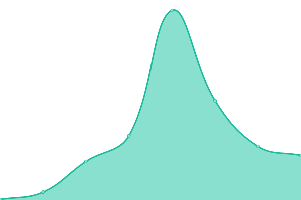
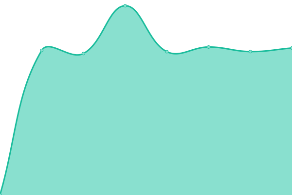

# [📈 Live Status](https://TogijorOK.github.io/Monitor_WEB): <!--live status--> **🟩 All systems operational**

This repository contains the open-source uptime monitor and status page for [Togijor](https://TogijorOK.github.io/Monitor_WEB), powered by [Upptime](https://github.com/upptime/upptime).

With [Upptime](https://upptime.js.org), you can get your own unlimited and free uptime monitor and status page, powered entirely by a GitHub repository. We use [Issues](https://github.com/TogijorOK/Monitor_WEB/issues) as incident reports, [Actions](https://github.com/TogijorOK/Monitor_WEB/actions) as uptime monitors, and [Pages](https://TogijorOK.github.io/Monitor_WEB) for the status page.

<!--start: status pages-->
<!-- This summary is generated by Upptime (https://github.com/upptime/upptime) -->
<!-- Do not edit this manually, your changes will be overwritten -->
<!-- prettier-ignore -->
| URL | Status | History | Response Time | Uptime |
| --- | ------ | ------- | ------------- | ------ |
|  [Sitio WEB Corporativo](https://aysa.com.ar) | 🟩 Up | [sitio-web-corporativo.yml](https://github.com/TogijorOK/Monitor_WEB/commits/HEAD/history/sitio-web-corporativo.yml) | 

 268ms
     
 | 

<a href="https://TogijorOK.github.io/Monitor_WEB/history/sitio-web-corporativo">100.00%</a>
    

|  [Intranet](https://intranet.aysa.com.ar) | 🟩 Up | [intranet.yml](https://github.com/TogijorOK/Monitor_WEB/commits/HEAD/history/intranet.yml) | 

 802ms
     
 | 

<a href="https://TogijorOK.github.io/Monitor_WEB/history/intranet">100.00%</a>
    

|  [Service Desk](https://servicedesk.aysa.com.ar) | 🟩 Up | [service-desk.yml](https://github.com/TogijorOK/Monitor_WEB/commits/HEAD/history/service-desk.yml) | 

 1264ms
     
 | 

<a href="https://TogijorOK.github.io/Monitor_WEB/history/service-desk">100.00%</a>
    

|  [Turnera](https://turnosonline.aysa.com.ar) | 🟩 Up | [turnera.yml](https://github.com/TogijorOK/Monitor_WEB/commits/HEAD/history/turnera.yml) | 

 257ms
     
 | 

<a href="https://TogijorOK.github.io/Monitor_WEB/history/turnera">100.00%</a>
    

|  [Correo (OWA)](https://mail.aysa.com.ar) | 🟩 Up | [correo-owa.yml](https://github.com/TogijorOK/Monitor_WEB/commits/HEAD/history/correo-owa.yml) | 

 1646ms
     
 | 

<a href="https://TogijorOK.github.io/Monitor_WEB/history/correo-owa">100.00%</a>
    

<!--end: status pages-->

[**Visit our status website →**](https://TogijorOK.github.io/Monitor_WEB)

## 📄 License

- Powered by: [Upptime](https://github.com/upptime/upptime)
- Code: [MIT](./LICENSE) © [Togijor](https://TogijorOK.github.io/Monitor_WEB)
- Data in the `./history` directory: [Open Database License](https://opendatacommons.org/licenses/odbl/1-0/)
